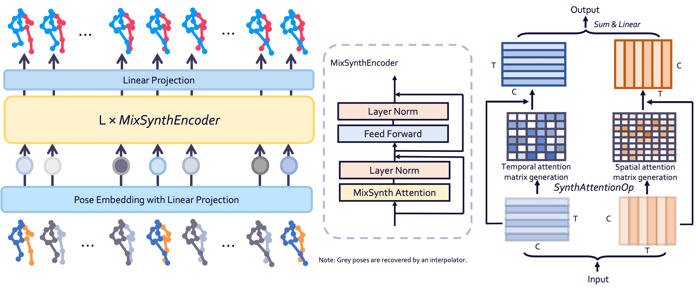
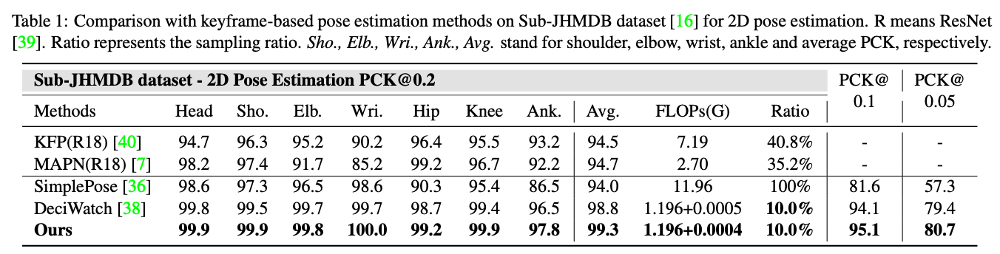
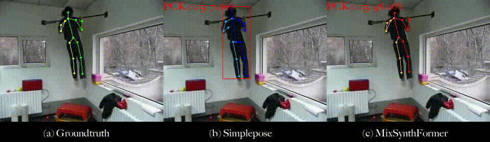
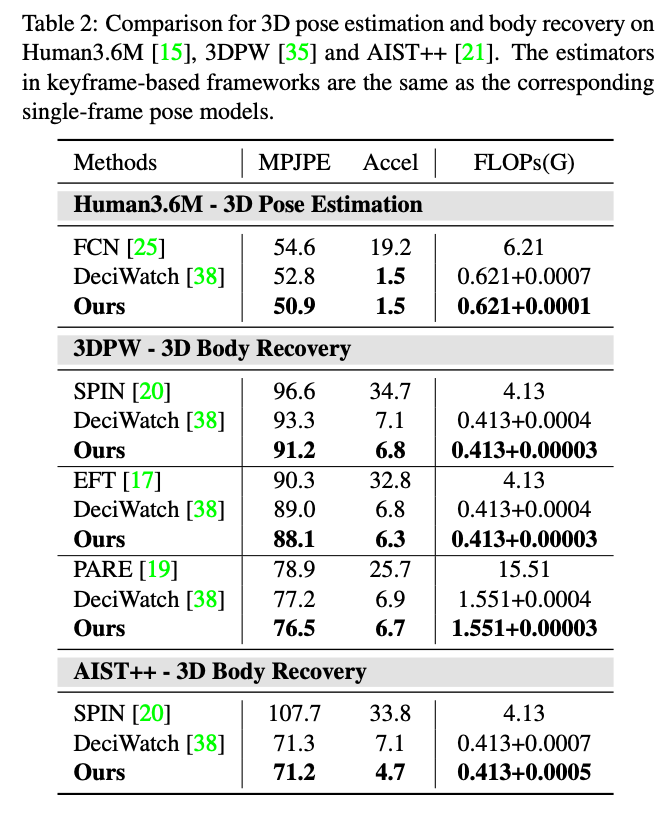
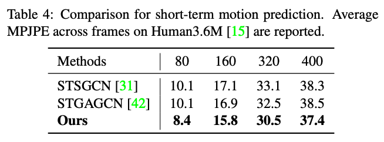

# MixSynthFormer: A Transformer Encoder-like Structure with Mixed Synthetic Self-attention for Efficient Human Pose Estimation (ICCV 2023)

This repo is the official implementation of **MixSynthFormer: A Transformer Encoder-like Structure with Mixed Synthetic Self-attention for Efficient Human Pose Estimation**. [[Paper]](https://openaccess.thecvf.com/content/ICCV2023/papers/Sun_MixSynthFormer_A_Transformer_Encoder-like_Structure_with_Mixed_Synthetic_Self-attention_for_ICCV_2023_paper.pdf)  [[Visualization]](https://youtu.be/8hkw3H2dlqc?si=noGXL4-uLqMg6GyZ)

## Description
Human pose estimation in videos has wide-ranging practical applications across various fields, many of which require fast inference on resource-scarce devices, necessitating the development of efficient and accurate algorithms. Previous works have demonstrated the feasibility of exploiting motion continuity to conduct pose estimation using sparsely sampled frames with transformer-based models. However, these methods only consider the temporal relation while neglecting spatial attention, and the complexity of dot product self-attention calculations in transformers are quadratically proportional to the embedding size. To address these limitations, we propose MixSynthFormer, a transformer encoder-like model with MLP-based mixed synthetic attention. By mixing synthesized spatial and temporal attentions, our model incorporates inter-joint and inter-frame importance and can accurately estimate human poses in an entire video sequence from sparsely sampled frames. Additionally, the flexible design of our model makes it versatile for other motion synthesis tasks. Our extensive experiments on 2D/3D pose estimation, body mesh recovery, and motion prediction validate the effectiveness and efficiency of MixSynthFormer.

 


## Quick start

### - Environment and datasets
We use the same environments and datasets as [DeciWatch](https://github.com/cure-lab/DeciWatch). Please refer to their repository for details.

### - Training
After activating the environment, run:
```
python train.py --cfg configs/config_<dataset>_<estimator>_<type>.yaml 
```
For example, training on h36m dataset for 3D tasks:
```
python train.py --cfg configs/config_h36m_fcn_3D.yaml 
```

## Results
### - 2D Pose Estimation


**Visualization on Sub-JHMDB:**

 


### - 3D Pose Estimation


**Visualization on AIST++:**
 
 


### - Short-term Motion Prediction



## Citation
If you find our work helpful for your research, please consider citing it as follows:

```bibtex
@InProceedings{Sun_2023_ICCV, 
author = {Sun, Yuran and Dougherty, Alan William and Zhang, Zhuoying and Choi, Yi King and Wu, Chuan}, 
title = {MixSynthFormer: A Transformer Encoder-like Structure with Mixed Synthetic Self-attention for Efficient Human Pose Estimation}, 
booktitle = {Proceedings of the IEEE/CVF International Conference on Computer Vision (ICCV)}, 
month = {October}, 
year = {2023}, 
pages = {14884-14893}
}
```

## Acknowledgement
Part of our code is borrowed from [DeciWatch](https://github.com/cure-lab/DeciWatch). We thank the authors for releasing the datasets and codes.